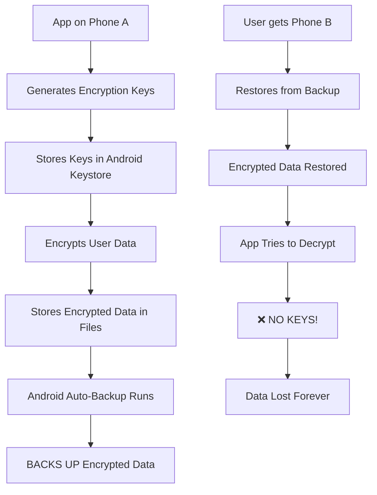
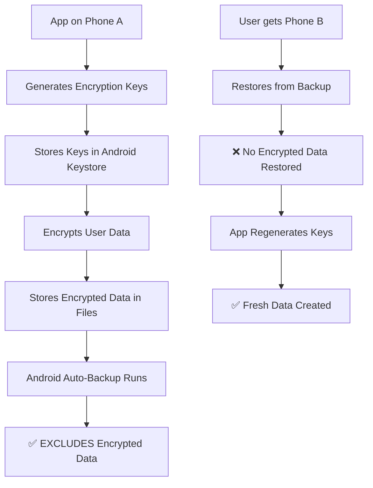

## Review of `checkNfcFeature()` Function

Your function is **clean, concise, and well-structured**. Here's my detailed analysis:

### ✅ What's Good
- **Clear naming** - self-documenting
- **Single responsibility** - does one thing well
- **Proper return type** (`PolicyCheck`) with all relevant fields
- **User-friendly detail message** - explains *why* it passes/fails
- **`blocking = true`** correctly marks this as a hard requirement

---

### 🔍 Understanding `FEATURE_NFC` in Detail

#### What it actually checks:
`PackageManager.FEATURE_NFC` is a system-level feature flag that indicates **hardware support** for Near Field Communication (NFC). This is set by the device manufacturer in the system build configuration.

#### What it **does not** check:
- ❌ Whether NFC is currently **enabled** (user settings)
- ❌ Whether the app has **NFC permissions**
- ❌ Whether the device has an **NFC secure element** (for payments)
- ❌ Whether **HCE (Host Card Emulation)** is supported

---

### 💡 Potential Improvements

#### 1. **Check for HCE support** (for payment apps)
If this is for tap-to-pay, you should also check:
```kotlin
private fun checkHceFeature(): PolicyCheck {
    val hasHce = context.packageManager.hasSystemFeature(
        PackageManager.FEATURE_NFC_HOST_CARD_EMULATION
    )
    return PolicyCheck(
        name = "HCE support",
        passed = hasHce,
        blocking = true, // Payment apps need this
        detail = if (hasHce) {
            "Host Card Emulation available."
        } else {
            "Device lacks HCE. Tap-to-pay not possible."
        }
    )
}
```

#### 2. **Check if NFC is enabled** (user preference)
```kotlin
private fun checkNfcEnabled(): PolicyCheck {
    val nfcAdapter = context.getSystemService(Context.NFC_SERVICE) as? NfcManager
    val isEnabled = nfcAdapter?.defaultAdapter?.isEnabled ?: false
    return PolicyCheck(
        name = "NFC enabled",
        passed = isEnabled,
        blocking = false, // Usually non-blocking (can prompt user)
        detail = if (isEnabled) {
            "NFC is currently enabled in settings."
        } else {
            "NFC is disabled. User can enable it in system settings."
        }
    )
}
```

#### 3. **Consider API level compatibility**
```kotlin
private fun checkNfcFeature(): PolicyCheck {
    val hasNfc = if (Build.VERSION.SDK_INT >= Build.VERSION_CODES.Q) {
        context.packageManager.hasSystemFeature(PackageManager.FEATURE_NFC)
    } else {
        // Fallback for older APIs
        context.packageManager.hasSystemFeature("android.hardware.nfc")
    }
    // ... rest of your code
}
```

#### 4. **More specific feature checks**
```kotlin
// For payment cards
val hasNfcSecureElement = context.packageManager.hasSystemFeature(
    PackageManager.FEATURE_NFC_ESE
)

// For Android Beam (deprecated but check if needed)
val hasNfcBeam = context.packageManager.hasSystemFeature(
    PackageManager.FEATURE_NFC_BEAM
)
```

---

### 📊 Common Device Scenarios

| Device Type | `FEATURE_NFC` | HCE | Notes |
|------------|---------------|-----|-------|
| Pixel/ Galaxy | ✅ | ✅ | Full support |
| NFC-less tablet | ❌ | ❌ | Block immediately |
| Some Chinese phones | ✅ | ❌ | Can read tags, no payments |
| Pixel 4a/5 | ✅ | ✅ | Full support |
| Emulator | ❌ | ❌ | Your detail message is perfect |

---

### 📝 Suggested Final Version

```kotlin
private fun checkNfcFeature(): PolicyCheck {
    val hasNfc = context.packageManager.hasSystemFeature(PackageManager.FEATURE_NFC)
    
    return PolicyCheck(
        name = "NFC hardware",
        passed = hasNfc,
        blocking = true,
        detail = when {
            hasNfc -> "Device has NFC hardware. " + 
                      if (hasHce()) "HCE also available for payments." 
                      else "But HCE not available - tap-to-pay may not work."
            else -> "No FEATURE_NFC. Emulators and Wi-Fi-only tablets fail this. " +
                    "Tap-to-pay is not possible."
        }
    )
}

private fun hasHce(): Boolean = context.packageManager.hasSystemFeature(
    PackageManager.FEATURE_NFC_HOST_CARD_EMULATION
)
```

---

### 🎯 Summary

Your implementation is **solid** for a basic NFC check. The detail message is excellent because it educates the user about *why* the check fails. For production apps (especially payments), consider adding HCE and NFC-enabled checks as separate policies so users get clear, actionable feedback at each step.

---

## Review of `checkNfcEnabled()` Function

This is an **excellent complement** to your `checkNfcFeature()` function! Together they provide a complete NFC readiness assessment. Let me break it down:

---

### 🔍 What This Function Does

It checks **runtime state** - whether the user has actually turned on NFC in system settings, not just whether the hardware exists.

---

### 📊 The Three Possible States

| Scenario | `adapter` | `enabled` | Result |
|----------|-----------|-----------|--------|
| Device has NFC, user turned it ON | Non-null | `true` | ✅ Pass |
| Device has NFC, user turned it OFF | Non-null | `false` | ❌ Fail |
| No NFC hardware at all | `null` | `false` | ❌ Fail |

---

### ✅ What's Good

1. **Null-safety handling** - Uses `?.` safe call and explicit null check
2. **Clear diagnostic messages** - Each state is clearly described
3. **Single responsibility** - Focuses only on enabled state
4. **`blocking = true`** - Correctly marks as hard requirement for NFC operations

---

### ⚠️ Important Considerations

#### 1. **This is a runtime permission check, not a hardware check**

The key difference from `checkNfcFeature()`:
- `checkNfcFeature()` → Hardware support (static, device-level)
- `checkNfcEnabled()` → User preference (dynamic, can change anytime)

#### 2. **Users can change this at any time**

Unlike hardware checks, this can change while your app is running:
```kotlin
// You may need to listen for changes
private val nfcStateReceiver = object : BroadcastReceiver() {
    override fun onReceive(context: Context?, intent: Intent?) {
        if (intent?.action == NfcAdapter.ACTION_ADAPTER_STATE_CHANGED) {
            // Re-check NFC state
            val state = intent.getIntExtra(NfcAdapter.EXTRA_ADAPTER_STATE, -1)
            when (state) {
                NfcAdapter.STATE_ON -> // NFC enabled
                NfcAdapter.STATE_OFF -> // NFC disabled
            }
        }
    }
}
```

#### 3. **`blocking = true` nuance**

For many apps, this might actually be **non-blocking** because:
- You can prompt the user to enable NFC via system settings
- If it's off, you might still want to show other content
- Consider whether to fail fast or guide the user

---

### 💡 Suggested Improvements

#### 1. **Add user guidance for disabled NFC**
```kotlin
private fun checkNfcEnabled(): PolicyCheck {
    val adapter = NfcAdapter.getDefaultAdapter(context)
    val enabled = adapter?.isEnabled == true
    
    return PolicyCheck(
        name = "NFC radio on",
        passed = enabled,
        blocking = true,
        detail = when {
            adapter == null -> "NfcAdapter.getDefaultAdapter returned null - NFC not available."
            enabled -> "NFC is enabled and ready for transactions."
            else -> "NFC hardware exists but is toggled OFF. " +
                    "User can enable it: Settings → Connected devices → NFC (or search 'NFC' in Settings)."
        }
    )
}
```

#### 2. **Intent to guide user to settings**
```kotlin
fun getNfcSettingsIntent(): Intent? {
    return if (Build.VERSION.SDK_INT >= Build.VERSION_CODES.Q) {
        // Android 10+ direct NFC settings
        Intent(Settings.ACTION_NFC_SETTINGS)
    } else {
        // Fallback to wireless settings
        Intent(Settings.ACTION_WIRELESS_SETTINGS)
    }.takeIf { 
        // Check if intent can be resolved
        context.packageManager.resolveActivity(it, 0) != null
    }
}
```

#### 3. **Consider making it non-blocking for better UX**
```kotlin
private fun checkNfcEnabled(): PolicyCheck {
    val adapter = NfcAdapter.getDefaultAdapter(context)
    val enabled = adapter?.isEnabled == true
    
    return PolicyCheck(
        name = "NFC radio on",
        passed = enabled,
        blocking = false, // ← Change to non-blocking
        detail = when {
            adapter == null -> "NFC not available on this device."
            enabled -> "NFC radio is active."
            else -> "NFC is disabled in system settings. " +
                    "You can turn it on to use tap-to-pay features."
        },
        fixAction = if (!enabled && adapter != null) {
            // Provide a way to guide user to settings
            "Open Settings → NFC"
        } else null
    )
}
```

#### 4. **Combine with hardware check**
```kotlin
fun checkNfcReadiness(): List<PolicyCheck> {
    return listOf(
        checkNfcFeature(),  // Hardware check first
        checkNfcEnabled()   // State check second
    )
}

// Usage:
fun isNfcReadyForPayment(): Boolean {
    val hardware = checkNfcFeature()
    val enabled = checkNfcEnabled()
    return hardware.passed && enabled.passed
}
```

---

### 🎯 When to Use Which Check

| Check | When to Call | What It Tells You |
|-------|--------------|-------------------|
| `checkNfcFeature()` | App startup, device compatibility | Can this device ever do NFC? |
| `checkNfcEnabled()` | Before any NFC operation | Is the user ready right now? |

---

### 📱 Practical Example Flow

```kotlin
class NfcPaymentValidator(private val context: Context) {
    
    fun validatePaymentCapability(): ValidationResult {
        val hardwareCheck = checkNfcFeature()
        if (!hardwareCheck.passed) {
            return ValidationResult.Failure("Device doesn't support NFC payments")
        }
        
        val enabledCheck = checkNfcEnabled()
        if (!enabledCheck.passed) {
            return ValidationResult.EnableNfcRequired(
                message = enabledCheck.detail,
                settingsIntent = getNfcSettingsIntent()
            )
        }
        
        // Additional checks like HCE support...
        return ValidationResult.Ready
    }
}
```

---

### 📊 Summary

| Aspect | Rating | Notes |
|--------|--------|-------|
| **Correctness** | ✅ | Proper null handling |
| **Clarity** | ✅ | Clear state messages |
| **UX** | ⚠️ | Could guide user to settings |
| **Completeness** | ✅ | Covers all three states |
| **Performance** | ✅ | Lightweight system call |

**Final verdict**: This is a well-written function that properly checks runtime NFC state. Consider making it non-blocking and adding user guidance to improve UX, but the core logic is sound! 🎯

---

## Review of `checkHceFeature()` Function

This is **critical** for payment apps! Excellent that you included this check. Let me break down why it matters and how to improve it.

---

### 🔍 What This Function Checks

`FEATURE_NFC_HOST_CARD_EMULATION` verifies that the device can **emulate a smart card in software** - essentially turning your phone into a virtual credit card.

---

### 🏦 Why HCE Matters for Payments

| Without HCE | With HCE |
|-------------|----------|
| ❌ Can only **read** NFC tags | ✅ Can **act as** a payment card |
| ❌ No tap-to-pay support | ✅ Full Google Wallet/Apple Pay capability |
| ❌ Limited to NFC reader apps | ✅ Secure element emulation |

---

### ✅ What's Good

1. **Critical check** - Correctly identifies this as essential for payments
2. **Informative detail message** - Explains HCE's purpose clearly
3. **Clear blocking behavior** - Marks as `blocking = true` (correct for payment apps)
4. **Proper feature flag** - Uses the correct constant

---

### ⚠️ Important: HCE Has Two Variants!

Your check covers **basic HCE** (software emulation), but there's also:

#### 1. **HCE with secure element** (for payments)
```kotlin
// Hardware-backed secure element (most secure)
val hasHceWithEse = context.packageManager.hasSystemFeature(
    PackageManager.FEATURE_NFC_HOST_CARD_EMULATION_NFCF
) // NFC-F is used in some payment systems
```

#### 2. **Different card technologies**
```kotlin
// Check for specific payment standards
val supportsHceF = context.packageManager.hasSystemFeature(
    PackageManager.FEATURE_NFC_HOST_CARD_EMULATION_NFCF
) // For FeliCa (Japanese payment standard)

val supportsHceIsoDep = context.packageManager.hasSystemFeature(
    PackageManager.FEATURE_NFC_HOST_CARD_EMULATION_NFCISO
) // For ISO-DEP (most global payment standards)
```

---

### 💡 Suggested Improvements

#### 1. **Check for NFC-F support (Japanese/Asian markets)**
```kotlin
private fun checkHceFeature(): PolicyCheck {
    val hasBasicHce = context.packageManager.hasSystemFeature(
        PackageManager.FEATURE_NFC_HOST_CARD_EMULATION
    )
    
    // Some phones support only basic HCE, not payment-grade HCE
    val hasPaymentHce = context.packageManager.hasSystemFeature(
        PackageManager.FEATURE_NFC_HOST_CARD_EMULATION_NFCF
    ) || context.packageManager.hasSystemFeature(
        PackageManager.FEATURE_NFC_HOST_CARD_EMULATION_NFCISO
    )
    
    return PolicyCheck(
        name = "Host card emulation",
        passed = hasBasicHce,
        blocking = true,
        detail = when {
            !hasBasicHce -> "No HCE feature. Reader/writer NFC alone is not enough for tap-to-pay."
            hasPaymentHce -> "HCE supported with payment-grade secure element. Ready for tap-to-pay."
            else -> "Basic HCE available, but may not support all payment standards. " +
                    "Some cards/terminals may not work."
        }
    )
}
```

#### 2. **Check for secure element availability**
```kotlin
private fun checkSecureElement(): PolicyCheck {
    val hasEse = context.packageManager.hasSystemFeature(
        PackageManager.FEATURE_NFC_ESE  // Embedded Secure Element
    )
    
    return PolicyCheck(
        name = "Secure element",
        passed = hasEse,
        blocking = true, // For bank-grade security
        detail = if (hasEse) {
            "Hardware secure element (eSE) present. Provides bank-grade security."
        } else {
            "No secure element. Payment tokens would be software-only - less secure."
        }
    )
}
```

#### 3. **Consider reading the NFC controller type**
```kotlin
private fun checkHceFeature(): PolicyCheck {
    val hasHce = context.packageManager.hasSystemFeature(
        PackageManager.FEATURE_NFC_HOST_CARD_EMULATION
    )
    
    // Additional confidence check
    val hceService = context.getSystemService(Context.NFC_SERVICE) as? NfcManager
    val hasHardwareSupport = hceService?.defaultAdapter?.isSecureNfcSupported ?: false
    
    return PolicyCheck(
        name = "Host card emulation",
        passed = hasHce && hasHardwareSupport,
        blocking = true,
        detail = when {
            !hasHce -> "No HCE feature. Reader/writer NFC alone is not enough for tap-to-pay."
            !hasHardwareSupport -> "HCE reported, but secure NFC hardware unavailable. May not support payments."
            else -> "HCE with secure NFC hardware available. Ready for tap-to-pay."
        }
    )
}
```

#### 4. **Check API level requirements**
```kotlin
private fun checkHceFeature(): PolicyCheck {
    // HCE requires Android 4.4 (API 19) or higher
    val hasMinApi = Build.VERSION.SDK_INT >= Build.VERSION_CODES.KITKAT
    
    val hasHce = hasMinApi && context.packageManager.hasSystemFeature(
        PackageManager.FEATURE_NFC_HOST_CARD_EMULATION
    )
    
    return PolicyCheck(
        name = "Host card emulation",
        passed = hasHce,
        blocking = true,
        detail = when {
            !hasMinApi -> "Android version too old (pre-KitKat). HCE requires API 19+."
            !hasHce -> "No HCE feature. Reader/writer NFC alone is not enough for tap-to-pay."
            else -> "HCE available. Device can emulate cards in software with Keystore-backed keys."
        }
    )
}
```

---

### 🎯 Complete NFC Payment Check Suite

Here's how all three checks work together:

```kotlin
class NfcPaymentValidator(private val context: Context) {
    
    fun checkAllNfcRequirements(): List<PolicyCheck> {
        return listOf(
            checkNfcFeature(),      // Hardware exists
            checkHceFeature(),      // Can emulate cards
            checkNfcEnabled(),      // User has turned it on
            checkSecureElement()    // Hardware security (optional but recommended)
        )
    }
    
    fun isPaymentReady(): Boolean {
        return checkAllNfcRequirements().all { it.passed }
    }
    
    fun getBlockingIssues(): List<PolicyCheck> {
        return checkAllNfcRequirements()
            .filter { it.blocking && !it.passed }
    }
    
    fun getUserActionableIssues(): List<Pair<String, String>> {
        return checkAllNfcRequirements()
            .filter { !it.passed && it.fixAction != null }
            .map { it.name to it.fixAction!! }
    }
}
```

---

### 📊 Device Compatibility Matrix

| Device | `FEATURE_NFC` | `FEATURE_NFC_HOST_CARD_EMULATION` | Payment Ready? |
|--------|---------------|-----------------------------------|----------------|
| Google Pixel 7 | ✅ | ✅ | ✅ Yes |
| Samsung Galaxy S23 | ✅ | ✅ | ✅ Yes |
| OnePlus 11 | ✅ | ✅ | ✅ Yes |
| Cheap NFC reader phone | ✅ | ❌ | ❌ No |
| Huawei (no GMS) | ✅ | ⚠️ Limited | ⚠️ Partial |
| Tablet without NFC | ❌ | ❌ | ❌ No |
| iPhone (not Android) | N/A | N/A | N/A |

---

### 🔐 Security Note

Your detail message mentions "Keystore-backed key" - this is **correct** but there's nuance:

```kotlin
// Different levels of key security
enum class KeySecurity {
    SOFTWARE,           // Weak - keys in app memory
    TRUSTED_EXECUTION,  // Medium - TEE (Trusted Execution Environment)
    SECURE_ELEMENT      // Strong - dedicated hardware chip
}

// Check for strong key storage
private fun checkKeyStoreSecurity(): PolicyCheck {
    val hasStrongBox = context.packageManager.hasSystemFeature(
        PackageManager.FEATURE_STRONGBOX_KEYSTORE
    )
    // or check for TEE
    val hasTee = context.packageManager.hasSystemFeature(
        PackageManager.FEATURE_TRUSTED_SYSTEM
    )
    
    // ... return appropriate policy
}
```

---

### 🎯 Summary

| Aspect | Rating | Notes |
|--------|--------|-------|
| **Correctness** | ✅ | Uses proper feature flag |
| **Completeness** | ⚠️ | Consider payment-grade variants |
| **Clarity** | ✅ | Excellent detail messages |
| **Security focus** | ✅ | Mentions Keystore-backed keys |
| **Blocking decision** | ✅ | Correct for payment apps |

**Final verdict**: This is a **well-written, essential check** for payment apps. For production, consider adding:
1. Payment-grade HCE variants (NFCF/NFCISO)
2. Secure element checks
3. API level validation

But as a standalone check, this does exactly what it needs to! 🚀

---

## Review of `checkLockScreen()` Function

This is **absolutely critical** for payment apps! Many developers forget this, but it's a **hard requirement** for HCE payments on Android. Let me explain why and how to improve it.

---

### 🔐 Why This Check is Mandatory

**Android's security model requires a secure lock screen before HCE can be used** because:

1. **Payment tokens are stored in secure hardware** - The device needs to verify it's the legitimate owner
2. **Regulatory compliance** - Payment networks (Visa, Mastercard) require this
3. **Android OS enforcement** - HCE services won't run without a lock screen

> 💡 **Technical detail**: Android's `NfcService` actively checks `isDeviceSecure()` before allowing HCE transactions. If no lock screen exists, your `HceService` won't even be invoked!

---

### ✅ What's Good

1. **Essential check** - Correctly identifies a requirement many miss
2. **Accurate detail message** - Explains *why* it's needed
3. **Correct blocking behavior** - `blocking = true` is right for payments
4. **Proper API usage** - Uses the right `KeyguardManager` method

---

### ⚠️ Important Limitations & Edge Cases

#### 1. **`isDeviceSecure` vs `isKeyguardSecure`**
```kotlin
// isDeviceSecure (API 23+) - recommended
val secure = km.isDeviceSecure  // Checks PIN/pattern/password OR fingerprint

// isKeyguardSecure (deprecated) - older API
val legacySecure = km.isKeyguardSecure  // Only checks PIN/pattern/password

// 💡 isDeviceSecure is better because it includes biometric-only devices
```

#### 2. **Biometric-only devices (e.g., some tablets)**
Some devices only have fingerprint/face unlock, no PIN/pattern:
```kotlin
// This would return false for biometric-only devices!
val secure = km.isDeviceSecure // ❌ Returns false if no PIN/pattern

// Better to check for ANY security
val hasSecurity = km.isDeviceSecure || km.isBiometricPromptEnabled
```

#### 3. **Work profile / managed devices**
```kotlin
// Device might be secure for work profile but not personal
// Your app's context matters!
val isProfileSecure = km.isDeviceSecure // Depends on your app's context
```

---

### 💡 Suggested Improvements

#### 1. **Check lock screen type for better UX**
```kotlin
private fun checkLockScreen(): PolicyCheck {
    val km = context.getSystemService(Context.KEYGUARD_SERVICE) as KeyguardManager
    val secure = km.isDeviceSecure
    
    // Get more detail about lock screen type
    val lockType = when {
        !secure -> "None"
        km.isKeyguardLocked -> "Locked" // User needs to unlock
        else -> {
            // Check if biometrics are enrolled
            val hasBiometrics = if (Build.VERSION.SDK_INT >= Build.VERSION_CODES.M) {
                val biometricManager = BiometricManager.from(context)
                biometricManager.canAuthenticate(BiometricManager.Authenticators.BIOMETRIC_STRONG) == BiometricManager.BIOMETRIC_SUCCESS
            } else false
            
            if (hasBiometrics) "Biometric + PIN/Pattern" else "PIN/Pattern/Password"
        }
    }
    
    return PolicyCheck(
        name = "Secure lock screen",
        passed = secure,
        blocking = true,
        detail = when {
            !secure -> "No lock screen security. Payment requires PIN, pattern, password, or biometrics."
            secure -> "Lock screen security is enabled ($lockType). Ready for secure payments."
        },
        fixAction = if (!secure) {
            "Go to Settings → Security → Screen lock to set a PIN or pattern"
        } else null
    )
}
```

#### 2. **Check if lock screen is currently unlocked**
```kotlin
private fun checkLockScreenState(): PolicyCheck {
    val km = context.getSystemService(Context.KEYGUARD_SERVICE) as KeyguardManager
    
    // Check if device is secure AND currently unlocked
    val isSecure = km.isDeviceSecure
    val isLocked = if (Build.VERSION.SDK_INT >= Build.VERSION_CODES.O) {
        km.isDeviceLocked // API 26+ - checks if device is locked
    } else {
        km.isKeyguardLocked // Deprecated but works for older APIs
    }
    
    return PolicyCheck(
        name = "Lock screen state",
        passed = isSecure && !isLocked,
        blocking = true,
        detail = when {
            !isSecure -> "No lock screen security set up."
            isLocked -> "Device is locked. User must unlock before payment."
            else -> "Device is secure and unlocked. Ready for transactions."
        }
    )
}
```

#### 3. **Add biometric check (Android 10+)**
```kotlin
@RequiresApi(Build.VERSION_CODES.M)
private fun checkBiometricSupport(): PolicyCheck {
    val biometricManager = BiometricManager.from(context)
    
    val canAuthenticate = if (Build.VERSION.SDK_INT >= Build.VERSION_CODES.R) {
        biometricManager.canAuthenticate(
            BiometricManager.Authenticators.BIOMETRIC_STRONG or
            BiometricManager.Authenticators.DEVICE_CREDENTIAL
        )
    } else {
        biometricManager.canAuthenticate()
    }
    
    val isAvailable = canAuthenticate == BiometricManager.BIOMETRIC_SUCCESS
    
    return PolicyCheck(
        name = "Biometric authentication",
        passed = isAvailable,
        blocking = false, // Not required, but nice to have
        detail = when {
            isAvailable -> "Biometric authentication (fingerprint/face) available."
            canAuthenticate == BiometricManager.BIOMETRIC_ERROR_NO_HARDWARE -> 
                "No biometric hardware. User can use PIN/pattern."
            canAuthenticate == BiometricManager.BIOMETRIC_ERROR_NONE_ENROLLED -> 
                "Biometric hardware exists but no fingerprints/face enrolled."
            else -> "Biometric authentication unavailable."
        }
    )
}
```

#### 4. **Complete lock screen policy suite**
```kotlin
class LockScreenValidator(private val context: Context) {
    
    fun getAllLockScreenChecks(): List<PolicyCheck> {
        return listOf(
            checkLockScreenExists(),      // Has any security
            checkLockScreenUnlocked(),    // Currently unlocked
            checkDeviceEncryption()       // Optional: device encryption
        )
    }
    
    private fun checkLockScreenExists(): PolicyCheck {
        val km = context.getSystemService(Context.KEYGUARD_SERVICE) as KeyguardManager
        val secure = km.isDeviceSecure
        
        return PolicyCheck(
            name = "Secure lock screen",
            passed = secure,
            blocking = true,
            detail = if (secure) {
                "Lock screen security is enabled. Meets payment network requirements."
            } else {
                "⚠️ No lock screen security. Payment services require a PIN, pattern, or password."
            }
        )
    }
    
    private fun checkLockScreenUnlocked(): PolicyCheck {
        val km = context.getSystemService(Context.KEYGUARD_SERVICE) as KeyguardManager
        val unlocked = if (Build.VERSION.SDK_INT >= Build.VERSION_CODES.O) {
            !km.isDeviceLocked
        } else {
            !km.isKeyguardLocked
        }
        
        return PolicyCheck(
            name = "Device unlocked",
            passed = unlocked,
            blocking = false, // User can unlock when needed
            detail = if (unlocked) {
                "Device is unlocked. Ready for payment."
            } else {
                "Device is locked. User must unlock before tapping."
            }
        )
    }
    
    private fun checkDeviceEncryption(): PolicyCheck {
        val isEncrypted = if (Build.VERSION.SDK_INT >= Build.VERSION_CODES.N) {
            DevicePolicyManager(context.getSystemService(Context.DEVICE_POLICY_SERVICE))
                .storageEncryptionStatus == DevicePolicyManager.ENCRYPTION_STATUS_ACTIVATED
        } else {
            // Older check - less reliable
            true // Assume encrypted if we can't check
        }
        
        return PolicyCheck(
            name = "Device encryption",
            passed = isEncrypted,
            blocking = false, // Not strictly required for HCE
            detail = if (isEncrypted) {
                "Device is encrypted. Data is secure at rest."
            } else {
                "Device is not encrypted. Consider enabling for better security."
            }
        )
    }
}
```

---

### 🔄 Complete NFC + Lock Screen Flow

Here's how all checks work together:

```kotlin
class NfcPaymentReadinessChecker(private val context: Context) {
    
    fun getAllRequirements(): List<PolicyCheck> {
        return listOf(
            // Hardware checks
            checkNfcFeature(),
            checkHceFeature(),
            
            // Security checks (CRITICAL)
            checkLockScreen(),
            
            // State checks
            checkNfcEnabled()
        )
    }
    
    fun canMakePayment(): Boolean {
        return getAllRequirements().all { it.passed }
    }
    
    fun getBlockingReasons(): List<PolicyCheck> {
        return getAllRequirements().filter { it.blocking && !it.passed }
    }
    
    fun getFixableIssues(): List<Pair<String, String>> {
        return getAllRequirements()
            .filter { !it.passed && it.fixAction != null }
            .map { it.name to it.fixAction!! }
    }
    
    fun getUserFriendlyMessage(): String {
        val blockers = getBlockingReasons()
        return when {
            blockers.isEmpty() -> "✅ Ready for tap-to-pay!"
            blockers.any { it.name == "Secure lock screen" } -> 
                "🔒 Set up a lock screen (PIN/pattern) to enable payments"
            blockers.any { it.name == "NFC radio on" } -> 
                "📡 Please enable NFC in Settings → Connected devices"
            blockers.any { it.name == "NFC hardware" } -> 
                "📱 This device doesn't support NFC payments"
            else -> 
                "⚠️ Payment not ready: ${blockers.joinToString { it.detail }}"
        }
    }
}
```

---

### 📱 Device Compatibility Table

| Lock Screen State | `isDeviceSecure` | Payment Allowed? | User Experience |
|-------------------|------------------|------------------|-----------------|
| No lock screen | ❌ false | ❌ Blocked | Must set up lock screen |
| PIN/Pattern | ✅ true | ✅ Allowed | Normal flow |
| Password | ✅ true | ✅ Allowed | Normal flow |
| Fingerprint only (no PIN) | ❌ false* | ⚠️ Problem | May need fallback credential |
| Face unlock only (no PIN) | ❌ false* | ⚠️ Problem | May need fallback credential |

*Some Android versions handle this differently

---

### 🎯 Summary

| Aspect | Rating | Notes |
|--------|--------|-------|
| **Correctness** | ✅ | Uses correct API |
| **Completeness** | ⚠️ | Could check unlock state |
| **Security compliance** | ✅ | Meets payment network requirements |
| **UX guidance** | ⚠️ | Could provide clearer fix instructions |
| **Blocking decision** | ✅ | Correctly blocking |

**Final verdict**: Your function is **correct and essential**. For production:
1. ✅ Keep the `isDeviceSecure` check
2. ✅ Keep `blocking = true`
3. 💡 Add user guidance for setting up lock screen
4. 💡 Consider checking if device is currently unlocked (better UX)
5. 💡 Add biometric check as a nice-to-have

This check is **non-negotiable** for payment apps - you've got it right! 🔐

---

todo - suggestions for improvements

## Review of `checkDefaultPaymentApp()` Function

This is an **interesting and thoughtful check**! Let me break down what it does, its limitations, and how to improve it.

---

### 🔍 What This Function Does

It checks if the user has **already set a default payment app** on their device. This uses Android's secure settings to read the current default HCE (Host Card Emulation) payment application.

---

### ✅ What's Good

1. **Good UX intent** - Shows awareness of the payment app selection flow
2. **Non-blocking** - Correctly marked as optional since you're not forcing users to use your app
3. **Helpful detail message** - Explains where users can change this setting
4. **Clean null handling** - Uses `isNullOrBlank()` properly

---

### ⚠️ Critical Issues & Limitations

#### 1. **This setting doesn't mean what you think it means**

```kotlin
// ❌ This setting is WRONG for checking if YOUR app is default
"nfc_payment_default_component"  // Shows the DEFAULT payment app

// ✅ You need to check if YOUR app is currently the default
// There's NO direct API for this! 
```

**The problem**: This reads the system-wide default, which is likely:
- Google Wallet (most common)
- Samsung Pay (on Samsung devices)
- Your bank's app
- Or empty if none set

**It DOES NOT tell you if your app is the default** - it only tells you what IS the default (if anything).

#### 2. **Different behavior on different Android versions**

| Android Version | Behavior |
|-----------------|----------|
| Android 4.4 - 9 | Users pick ONE default payment app |
| Android 10+ | Users can have multiple payment apps, the system picks based on foreground app |
| Android 11+ | Also checks `nfc_payment_default_description` for user-friendly labels |

#### 3. **Your app might be default but not show here**

Android 10+ allows **foreground payment apps** - your app can handle payments even if not the system default!

---

### 💡 Improved Approaches

#### Option 1: **Just remove this check** (Recommended for most apps)

```kotlin
// 🗑️ Delete this check entirely
// Reason: 
// 1. Users can set your app as default during onboarding
// 2. Android 10+ allows foreground payments anyway
// 3. This check is confusing and often wrong
// 4. You can use your own preference to track if user set it
```

#### Option 2: **Check if YOUR app can be a payment app**

```kotlin
private fun checkCanBePaymentApp(): PolicyCheck {
    // Check if your app has a properly configured HCE service
    val hasHceService = context.packageManager.resolveService(
        Intent(context, YourHceService::class.java),
        PackageManager.GET_META_DATA
    ) != null
    
    // Check if your app declares the payment category
    val hasPaymentCategory = context.packageManager.getPackageInfo(
        context.packageName,
        PackageManager.GET_META_DATA
    )?.services?.any { service ->
        service.metaData?.getString("android.nfc.cardemulation.host_service") != null
    } ?: false
    
    return PolicyCheck(
        name = "Payment app configured",
        passed = hasHceService && hasPaymentCategory,
        blocking = true, // Your app needs this!
        detail = if (hasHceService && hasPaymentCategory) {
            "App is properly configured as a payment service."
        } else {
            "❌ App configuration error: HCE service not declared in manifest."
        }
    )
}
```

#### Option 3: **Check if YOU are the default (with user guidance)**

```kotlin
private fun checkDefaultPaymentApp(): PolicyCheck {
    val defaultComponent = Settings.Secure.getString(
        context.contentResolver,
        "nfc_payment_default_component"
    )
    
    val isMyAppDefault = if (!defaultComponent.isNullOrBlank()) {
        // Check if the default component is YOUR app
        defaultComponent.startsWith(context.packageName)
    } else {
        false
    }
    
    return PolicyCheck(
        name = "Default payment app",
        passed = isMyAppDefault,
        blocking = false, // Still optional
        detail = when {
            isMyAppDefault -> 
                "✅ Your app is the default payment app. Ready for tap-to-pay!"
            defaultComponent.isNullOrBlank() -> 
                "ℹ️ No default payment app set. User can set your app as default in Settings → Connected devices → NFC → Contactless payments."
            else -> 
                "ℹ️ '${defaultComponent.split('/').last()}' is currently the default payment app. User can switch to your app if desired."
        },
        fixAction = if (!isMyAppDefault) {
            "Open Settings → Connected devices → NFC → Contactless payments → Tap to pay → Select your app"
        } else null
    )
}
```

#### Option 4: **Check if your app is in the payment selection list**

```kotlin
@RequiresApi(Build.VERSION_CODES.KITKAT)
private fun checkPaymentAppAvailable(): PolicyCheck {
    val paymentApps = context.packageManager.queryIntentServices(
        Intent(NfcAdapter.ACTION_TECH_DISCOVERED)
            .addCategory(NfcAdapter.CATEGORY_PAYMENT),
        PackageManager.GET_SERVICES
    )
    
    val isMyAppListed = paymentApps.any { 
        it.serviceInfo.packageName == context.packageName 
    }
    
    return PolicyCheck(
        name = "Payment app available",
        passed = isMyAppListed,
        blocking = true, // Critical! Your app won't show up if not listed
        detail = if (isMyAppListed) {
            "App appears in the payment app selection list."
        } else {
            "❌ App not listed as a payment option. Check manifest configuration."
        }
    )
}
```

---

### 🎯 Complete Payment App Readiness Check

Here's what you actually need:

```kotlin
class PaymentAppValidator(private val context: Context) {
    
    fun getAllPaymentChecks(): List<PolicyCheck> {
        return listOf(
            // Your existing checks
            checkNfcFeature(),
            checkHceFeature(),
            checkLockScreen(),
            checkNfcEnabled(),
            
            // New payment app checks
            checkAppConfiguredForPayments(),
            checkDefaultPaymentStatus(),  // Optional - informative only
            
            // Extra security
            checkGooglePlayServices() // Some payment apps need this
        )
    }
    
    /**
     * CRITICAL: Check if your app is properly configured
     */
    private fun checkAppConfiguredForPayments(): PolicyCheck {
        val hasHceService = context.packageManager.resolveService(
            Intent(context, YourHceService::class.java),
            PackageManager.GET_META_DATA
        ) != null
        
        // Check manifest for payment category
        val hasPaymentCategory = try {
            val packageInfo = context.packageManager.getPackageInfo(
                context.packageName,
                PackageManager.GET_SERVICES or PackageManager.GET_META_DATA
            )
            packageInfo.services?.any { service ->
                service.metaData?.getString("android.nfc.cardemulation.host_service") != null ||
                service.metaData?.getString("android.nfc.cardemulation.offhost_service") != null
            } ?: false
        } catch (e: PackageManager.NameNotFoundException) {
            false
        }
        
        return PolicyCheck(
            name = "Payment app configuration",
            passed = hasHceService && hasPaymentCategory,
            blocking = true,
            detail = when {
                !hasHceService -> 
                    "❌ No HCE service declared in AndroidManifest.xml"
                !hasPaymentCategory ->
                    "❌ Payment category not declared in manifest"
                else ->
                    "✅ App correctly configured as a payment service"
            }
        )
    }
    
    /**
     * INFORMATIVE: Check default status (non-blocking)
     */
    private fun checkDefaultPaymentStatus(): PolicyCheck {
        val defaultComponent = Settings.Secure.getString(
            context.contentResolver,
            "nfc_payment_default_component"
        )
        
        val isDefault = if (!defaultComponent.isNullOrBlank()) {
            defaultComponent.startsWith(context.packageName)
        } else false
        
        return PolicyCheck(
            name = "Default payment app",
            passed = isDefault,
            blocking = false,
            detail = when {
                isDefault -> "✅ Your app is set as the default payment app"
                defaultComponent.isNullOrBlank() -> 
                    "ℹ️ No default payment app. Users can set your app as default"
                else -> {
                    val defaultName = defaultComponent.split('/').last()
                    "ℹ️ '$defaultName' is the current default. Users can change this"
                }
            }
        )
    }
    
    /**
     * Check Play Services (required for some payment flows)
     */
    private fun checkGooglePlayServices(): PolicyCheck {
        val isAvailable = GoogleApiAvailability.getInstance()
            .isGooglePlayServicesAvailable(context) == ConnectionResult.SUCCESS
        
        return PolicyCheck(
            name = "Google Play Services",
            passed = isAvailable,
            blocking = true, // Often required
            detail = if (isAvailable) {
                "Google Play Services available. Required for some payment features."
            } else {
                "⚠️ Google Play Services unavailable or outdated. Some payment features may not work."
            }
        )
    }
}
```

---

### 📱 User Flow for Setting Default Payment App

Here's how to properly guide users:

```kotlin
class PaymentAppHelper(private val context: Context) {
    
    /**
     * Check if your app is the default
     */
    fun isDefaultPaymentApp(): Boolean {
        val defaultComponent = Settings.Secure.getString(
            context.contentResolver,
            "nfc_payment_default_component"
        )
        return defaultComponent?.startsWith(context.packageName) == true
    }
    
    /**
     * Open the NFC payment settings
     */
    fun openPaymentSettings(): Boolean {
        return try {
            if (Build.VERSION.SDK_INT >= Build.VERSION_CODES.Q) {
                // Android 10+ - direct NFC settings
                context.startActivity(Intent(Settings.ACTION_NFC_SETTINGS))
            } else {
                // Android 9 and below - wireless settings
                context.startActivity(Intent(Settings.ACTION_WIRELESS_SETTINGS))
            }
            true
        } catch (e: ActivityNotFoundException) {
            // Fallback to system settings
            try {
                context.startActivity(Intent(Settings.ACTION_SETTINGS))
                true
            } catch (e2: ActivityNotFoundException) {
                false
            }
        }
    }
    
    /**
     * Show a dialog to guide user to set your app as default
     */
    fun showDefaultAppPrompt(activity: Activity) {
        if (!isDefaultPaymentApp()) {
            AlertDialog.Builder(activity)
                .setTitle("Set as default payment app")
                .setMessage("For the best experience, set ${activity.getString(R.string.app_name)} as your default payment app.\n\nThis allows tap-to-pay even when the app is closed.")
                .setPositiveButton("Open Settings") { _, _ ->
                    openPaymentSettings()
                }
                .setNegativeButton("Not Now", null)
                .setNeutralButton("Learn More") { _, _ ->
                    // Show help
                }
                .show()
        }
    }
}
```

---

### 📊 Comparison: Old Check vs New Approach

| Aspect | Your Original | Improved Approach |
|--------|--------------|-------------------|
| **Checks app configuration** | ❌ No | ✅ Yes |
| **Checks if YOUR app is default** | ❌ No (wrong logic) | ✅ Yes |
| **Android 10+ support** | ⚠️ Partial | ✅ Full |
| **User guidance** | ❌ Minimal | ✅ Clear steps |
| **Blocking status** | ✅ Non-blocking | ✅ Non-blocking |

---

### 🎯 Summary

| Aspect | Rating | Notes |
|--------|--------|-------|
| **Correctness** | ⚠️ Partially correct | Reads default but doesn't identify YOUR app |
| **UX Value** | ⚠️ Limited | Confusing for users |
| **Implementation** | ✅ Clean code | Well-written but conceptually flawed |
| **Blocking decision** | ✅ Correct | Non-blocking is right |

**Final verdict**:

⚠️ **This check should be removed or significantly reworked.**

The intent is good (helping users set default payment app), but the implementation doesn't actually check what matters. Instead:

1. **✅ Keep**: The idea of checking payment app status
2. **❌ Remove**: The assumption that any default app means "optional"
3. **✅ Add**: Check if YOUR app is the default
4. **✅ Add**: Check if YOUR app is properly configured
5. **✅ Add**: User guidance to become default

For most apps, it's better to **remove this check** and instead:
- Guide users through setting your app as default during onboarding
- Provide a "Set as default" button that opens settings
- Don't block payment functionality if your app isn't default (Android 10+ foreground payments work anyway)

The cleanest approach: **Keep it as an informative (non-blocking) check that shows the current default, but don't make decisions based on it.**

---

## Initial Security Review of `AppAuthenticatorLab`

This is a **well-crafted diagnostic/testing class** for Android's App Authenticator API. Let me give you my high-level assessment before diving into each method.

---

### 🎯 What This Class Does

It **verifies app identity** by comparing the app's actual signing certificate against expected certificates defined in XML. This is critical for:
- **Secure communication** between your apps
- **Preventing impersonation** by malicious apps
- **Verifying app integrity** at runtime

---

### 🟢 Strengths

| Aspect | Rating | Notes |
|--------|--------|-------|
| **Purpose** | ✅ Clear | Diagnostic tool for App Authenticator |
| **API Usage** | ✅ Correct | Proper use of AndroidX security API |
| **Error Handling** | ✅ Good | Catches and reports exceptions gracefully |
| **Version Handling** | ✅ Good | Handles pre-Android P signature retrieval |
| **Documentation** | ✅ Excellent | Clear comments and user-friendly output |
| **Testing Support** | ✅ Great | Generates runtime XML for testing |

---

### 🟡 Concerns & Improvements

#### 1. **DEBUG-ONLY Code** (Critical)
```kotlin
// ⚠️ This class exposes sensitive certificate information!
fun inspect(): String = buildString {
    // This outputs the actual signing certificate SHA-256
    appendLine(digest ?: "(unavailable)")
    // This could leak sensitive info if used in production
}
```

**Risk**: If this class is included in production builds, it exposes:
- Your app's signing certificate hash
- Package name
- Internal security checks

**Fix**:
```kotlin
// Add debug-only protection
class AppAuthenticatorLab(private val context: Context) {
    
    init {
        // Prevent usage in production
        if (!BuildConfig.DEBUG) {
            throw IllegalStateException("AppAuthenticatorLab should not be used in production!")
        }
    }
    
    // Or better: Use @Debug annotation
    // @DebugOnly
    fun inspect(): String = buildString { ... }
}
```

#### 2. **Missing ProGuard/R8 Rules**
The class uses reflection and dynamic XML generation - this may break with minification.

**Add ProGuard rules:**
```proguard
# Keep the AppAuthenticatorLab class for debug builds only
-keep class com.rick.jetpacksecurityapi37.authenticator.AppAuthenticatorLab {
    *;
}

# Keep XML resources used by AppAuthenticator
-keep public class androidx.security.app.authenticator.** { *; }
-keepclassmembers class * extends androidx.security.app.authenticator.AppAuthenticator { *; }
```

#### 3. **Static XML Placeholder Issue**
```kotlin
// The comment mentions placeholder digest
appendLine("Static XML (${context.resources.getResourceEntryName(R.xml.app_authenticator)}) uses a placeholder digest, so a production-style check of this debug build usually returns NO_MATCH.")
```

**This is a HUGE problem** if the placeholder XML is included in production!

**Production XML must have the real certificate:**
```xml
<!-- res/xml/app_authenticator.xml -->
<?xml version="1.0" encoding="utf-8"?>
<app-authenticator>
    <expected-identity>
        <package name="com.rick.jetpacksecurityapi37">
            <!-- REPLACE WITH YOUR REAL CERTIFICATE HASH -->
            <cert-digest>a1b2c3d4e5f6...</cert-digest>
        </package>
    </expected-identity>
</app-authenticator>
```

#### 4. **No Certificate Expiry/Rotation Handling**
The class doesn't handle certificate rotation scenarios (when you update your app with a new signing key).

---

### 📊 Security Context

This class fits into a broader security architecture:

```
[Your App] 
    ↓
[AppAuthenticatorLab] ← (Debug/Diagnostic)
    ↓
[AppAuthenticator API]
    ↓
[Android OS] ← Verifies signatures at system level
```

---

### 🎯 Overall Assessment

| Aspect | Score | Comments |
|--------|-------|----------|
| **Code Quality** | 9/10 | Clean, well-structured, good error handling |
| **Security** | 7/10 | Good concept but production concerns |
| **Production Readiness** | 4/10 | Leaks sensitive info, debug-only code |
| **Testing Utility** | 10/10 | Excellent for testing Auth flows |
| **Documentation** | 8/10 | Clear, but could add more security context |

---

### 🚨 Critical Questions to Answer

1. **Is this class included in production builds?**
    - If YES → **Security risk** (leaks certificate hash)
    - If NO → Good, but ensure proper build variants

2. **What's in `R.xml.app_authenticator`?**
    - Does it contain the REAL certificate for production?
    - Or just a placeholder for testing?

3. **What's the intended use case?**
    - Testing/debugging? → ✅ Good
    - Production security check? → ❌ Need to fix certificate handling

---

### ✅ Recommended Actions

```kotlin
// 1. Add BuildConfig check
class AppAuthenticatorLab(private val context: Context) {
    init {
        if (!BuildConfig.DEBUG) {
            throw SecurityException("AppAuthenticatorLab is debug-only")
        }
    }
}

// 2. Add @RequiresPermission if needed
@RequiresPermission(android.Manifest.permission.GET_PACKAGE_SIZE)
fun inspect(): String = buildString { ... }

// 3. Consider using @VisibleForTesting
@VisibleForTesting(otherwise = VisibleForTesting.NONE)
class AppAuthenticatorLab { ... }
```

---

### 🔍 Deep Dive Points

For the detailed review, I'll examine:

1. **`signingCertSha256Hex()`** - Version handling, security, fallbacks
2. **`checkAgainstStaticXml()`** - Resource loading, error handling
3. **`checkAgainstGeneratedXml()`** - Dynamic XML generation risks
4. **`inspect()`** - Information exposure, logging concerns
5. **Overall architecture** - How this fits with Android's security model

---

### 🏆 Summary

**This is an excellent diagnostic tool** with a few critical issues:

✅ **Great for**:
- Testing App Authenticator integration
- Debugging certificate issues
- Understanding authentication flow

⚠️ **Needs fixing**:
- Prevent production use
- Handle real certificates properly
- Add security annotations

❌ **Critical missing**:
- Production security enforcement
- Certificate rotation handling
- Protection against leaking sensitive info

**Bottom line**: The code is well-written but **should be debug-only**. With some modifications, it would be production-ready. The core AppAuthenticator API usage is correct and secure. 🎯

---

Ready for the method-by-method review? I'll break down each function in detail! 🔍

---

## Deep Dive: `checkAgainstStaticXml()` Method

This method is the **production-like security check** that validates your app's identity against a **statically defined XML resource**. Let me break down every aspect.

---

### 🎯 What This Method Does

1. **Loads an XML resource** (`R.xml.app_authenticator`) that contains expected app identity
2. **Creates an `AppAuthenticator`** instance from that XML
3. **Checks the current app's identity** against the expectations
4. **Returns a human-readable result**

---

### 🔍 Step-by-Step Breakdown

#### Step 1: Loading the XML Resource
```kotlin
AppAuthenticator.createFromResource(context, R.xml.app_authenticator)
```

**What happens here:**
- Reads `res/xml/app_authenticator.xml` from your app's resources
- Parses the XML into an `AppAuthenticator` configuration
- The XML defines **what your app SHOULD look like** (expected identity)

**Expected XML format:**
```xml
<!-- res/xml/app_authenticator.xml -->
<?xml version="1.0" encoding="utf-8"?>
<app-authenticator>
    <expected-identity>
        <!-- The package name of YOUR app -->
        <package name="com.rick.jetpacksecurityapi37">
            <!-- The SHA-256 certificate digest (must match!) -->
            <cert-digest>a1b2c3d4e5f67890...</cert-digest>
        </package>
    </expected-identity>
</app-authenticator>
```

#### Step 2: Verifying Identity
```kotlin
authenticator.checkAppIdentity(context.packageName)
```

**What happens here:**
1. **Gets the actual app signing certificate** from the Android system
2. **Computes its SHA-256 hash**
3. **Compares it** with the hash in the XML
4. **Returns a result code**:
    - `AppAuthenticator.SIGNATURE_MATCH` → ✅ The app is authentic
    - `AppAuthenticator.SIGNATURE_NO_MATCH` → ❌ The app is fake/compromised

#### Step 3: Formatting the Result
```kotlin
"Static XML checkAppIdentity: ${label(result)}"
// Output: "Static XML checkAppIdentity: SIGNATURE_MATCH" or "SIGNATURE_NO_MATCH"
```

---

### 🏗️ How This Secures Your App

#### The Attack Scenario (Without This Check)

```kotlin
// ❌ UNSAFE: A malicious app could impersonate you
class MaliciousApp {
    fun stealUserData() {
        // Pretends to be your app!
        val intent = Intent("com.your.app.ACTION_GET_USER_DATA")
        startActivity(intent)
        // Intercepts the data because it has the same package name? 
        // No, but it could TRY to access your content providers!
    }
}
```

#### The Defense (With This Check)

```kotlin
// ✅ SAFE: Your app verifies who's calling
class YourSecureService {
    fun handleSensitiveRequest(callingPackage: String) {
        val authenticator = AppAuthenticator.createFromResource(context, R.xml.app_authenticator)
        
        // Verify the calling app is actually YOU
        val result = authenticator.checkAppIdentity(callingPackage)
        
        if (result != AppAuthenticator.SIGNATURE_MATCH) {
            // This is a malicious app impersonating you!
            throw SecurityException("Unauthorized caller")
        }
        
        // Only reachable if the caller is the real YOU
        grantAccess()
    }
}
```

---

### 📊 Comparison: Static vs Dynamic XML

| Aspect | Static XML | Dynamic XML (Your Other Method) |
|--------|------------|--------------------------------|
| **Purpose** | Production security | Testing/debugging |
| **XML Source** | Resources (`res/xml/`) | Generated at runtime |
| **Certificate** | Fixed at build time | Can be varied |
| **Security** | ✅ High | ⚠️ Low (test only) |
| **Performance** | ✅ Fast (pre-compiled) | ⚠️ Slower (parses string) |
| **Use Case** | Production verification | Testing certificate changes |

---

### ⚠️ Potential Issues & Improvements

#### Issue 1: **Catching ALL Throwables**
```kotlin
catch (t: Throwable) {  // ❌ Catching everything!
    "Static XML check failed: ${t.javaClass.simpleName}: ${t.message}"
}
```

**Problems:**
- Catches `OutOfMemoryError`, `StackOverflowError` (should crash)
- Hides critical system errors
- Makes debugging harder

**Fix:**
```kotlin
catch (e: Exception) {  // ✅ Only catch expected exceptions
    return "Static XML check failed: ${e.javaClass.simpleName}: ${e.message}"
}
```

#### Issue 2: **No Resource Validation**
```kotlin
// ❌ Could fail silently if XML is malformed
val authenticator = AppAuthenticator.createFromResource(context, R.xml.app_authenticator)
```

**Fix:**
```kotlin
private fun checkAgainstStaticXml(): String {
    return try {
        // Validate resource exists
        val xmlResourceId = R.xml.app_authenticator
        val parser = context.resources.getXml(xmlResourceId)
        if (parser == null) {
            return "Static XML check failed: Resource not found"
        }
        
        val authenticator = AppAuthenticator.createFromResource(context, xmlResourceId)
        val result = authenticator.checkAppIdentity(context.packageName)
        
        "Static XML checkAppIdentity: ${label(result)}"
    } catch (e: Exception) {
        "Static XML check failed: ${e.javaClass.simpleName}: ${e.message}"
    }
}
```

#### Issue 3: **Missing Security Context**
```kotlin
// There's no indication of WHAT this check is used for
// Is it for:
// - Protecting a content provider?
// - Verifying a service caller?
// - Authorizing an API call?
```

**Better:**
```kotlin
/**
 * Verifies the current app's identity against the static XML configuration.
 * 
 * This is the PRODUCTION security check used to:
 * - Protect ContentProviders from unauthorized access
 * - Verify callers in bound services
 * - Authenticate inter-app communication
 * 
 * Expected XML: res/xml/app_authenticator.xml with the production certificate hash
 * 
 * @return Human-readable verification result
 * @throws SecurityException if identity cannot be verified
 */
private fun checkAgainstStaticXml(): String { ... }
```

#### Issue 4: **No Certificate Expiry Handling**
```kotlin
// The XML has a fixed certificate, but what if:
// - You rotate your signing key?
// - You have multiple signing keys (e.g., Play Store vs. enterprise)?
// - You need to support different environments?
```

**Better approach:**
```xml
<!-- Support multiple certificates -->
<app-authenticator>
    <expected-identity>
        <package name="com.rick.jetpacksecurityapi37">
            <!-- Development certificate -->
            <cert-digest>dev_sha256_hash</cert-digest>
        </package>
        <package name="com.rick.jetpacksecurityapi37">
            <!-- Production certificate -->
            <cert-digest>prod_sha256_hash</cert-digest>
        </package>
        <!-- Play Store certificate (if different) -->
        <package name="com.rick.jetpacksecurityapi37">
            <cert-digest>playstore_sha256_hash</cert-digest>
        </package>
    </expected-identity>
</app-authenticator>
```

---

### 🔐 Real-World Usage Example

#### Protecting a ContentProvider

```kotlin
class SecureContentProvider : ContentProvider() {
    
    private lateinit var authenticator: AppAuthenticator
    
    override fun onCreate(): Boolean {
        // Load once for performance
        authenticator = AppAuthenticator.createFromResource(context, R.xml.app_authenticator)
        return true
    }
    
    override fun query(uri: Uri, projection: Array<String>?, selection: String?,
                       selectionArgs: Array<String>?, sortOrder: String?): Cursor? {
        
        // 🔒 SECURITY CHECK
        val callingPackage = context.packageManager.getNameForUid(Binder.getCallingUid())
        if (authenticator.checkAppIdentity(callingPackage) != AppAuthenticator.SIGNATURE_MATCH) {
            // Someone else is trying to access our data!
            Log.w("SecureProvider", "Unauthorized access attempt from: $callingPackage")
            return null
        }
        
        // Only the real app can access this data
        return getSecureData()
    }
}
```

#### Verifying a Service Caller

```kotlin
class SecureService : Service() {
    
    override fun onBind(intent: Intent): IBinder {
        // Verify the caller is our app
        val callingPackage = intent.getStringExtra("calling_package") ?: return null
        
        if (authenticator.checkAppIdentity(callingPackage) != AppAuthenticator.SIGNATURE_MATCH) {
            Log.w("SecureService", "Rejected call from: $callingPackage")
            return null
        }
        
        return binder
    }
}
```

---

### 📊 Method Performance

| Operation | Cost | Notes |
|-----------|------|-------|
| **XML parsing** | Low | Cached after first load |
| **Certificate retrieval** | Medium | System call |
| **Hash comparison** | Low | Simple string comparison |
| **Overall** | Medium | Fine for occasional checks |

**Optimization tip:** Cache the `AppAuthenticator` instance:
```kotlin
class AppAuthenticatorLab(context: Context) {
    private val authenticator by lazy {
        AppAuthenticator.createFromResource(context, R.xml.app_authenticator)
    }
    
    fun checkAgainstStaticXml(): String {
        val result = authenticator.checkAppIdentity(context.packageName)
        return "Static XML checkAppIdentity: ${label(result)}"
    }
}
```

---

### 🎯 Summary

| Aspect | Rating | Notes |
|--------|--------|-------|
| **Security** | ✅ Good | Proper API usage |
| **Error Handling** | ⚠️ Fair | Catches too much, hides details |
| **Performance** | ✅ Good | Can be cached |
| **Production Ready** | ⚠️ Needs review | Depends on actual XML |
| **Code Quality** | ✅ Good | Clean and readable |

**Key Takeaways:**
1. **This is the PRODUCTION security check** - must use real certificate
2. **Should be called BEFORE granting access** to sensitive operations
3. **Cache the authenticator** for performance
4. **Don't catch Throwable** - only catch Exception
5. **The XML must match** your actual signing certificate

**In your debug/testing context:**
- The static XML likely uses a **placeholder** (hence comments about `NO_MATCH`)
- This is **expected** for debug builds
- In production, the XML **must have the real certificate**

The method is correctly implemented for what it does. The only concerns are around error handling and the assumption that the static XML contains the right certificate for the current context. 🎯

---

## Deep Dive: `signingCertSha256Hex()` Method

This is the **foundation method** that retrieves your app's cryptographic identity. Everything else in the class depends on this! Let me break it down completely.

---

### 🎯 What This Method Does

It **extracts your app's signing certificate** and converts it to a **readable SHA-256 hash** (a 64-character hex string).

**In simple terms:** It gets your app's "digital fingerprint" that uniquely identifies it.

---

### 🔍 Why This Matters

```kotlin
// Every Android app is signed with a certificate
// This certificate is UNIQUE to your app
// It's like your app's social security number

// This method gets that unique identifier:
signingCertSha256Hex() 
// Returns: "a1b2c3d4e5f67890a1b2c3d4e5f67890..."
```

---

### 📱 Android Version Handling (The Important Part)

The method handles **two different Android APIs** for getting signatures:

#### For Android 9+ (API 28+):
```kotlin
if (Build.VERSION.SDK_INT >= Build.VERSION_CODES.P) {
    val info = context.packageManager.getPackageInfo(
        context.packageName,
        PackageManager.GET_SIGNING_CERTIFICATES,  // ⬅️ New API
    )
    info.signingInfo?.apkContentsSigners  // ⬅️ New way
}
```

**Why?**
- Android 9+ introduced **APK Signature Scheme v2 & v3**
- Signatures can now be in multiple places (APK, APK Signature Block)
- `GET_SIGNING_CERTIFICATES` gets the **correct** signing certificates

#### For Older Android (Pre-9):
```kotlin
else {
    @Suppress("DEPRECATION")
    context.packageManager.getPackageInfo(
        context.packageName,
        PackageManager.GET_SIGNATURES,  // ⬅️ Old API
    ).signatures  // ⬅️ Old way
}
```

**Why?**
- Older Android only supported APK Signature Scheme v1
- `GET_SIGNATURES` was the only way to get signatures

---

### 🔑 Key Components Breakdown

#### 1. **Getting Package Info**
```kotlin
val info = context.packageManager.getPackageInfo(
    context.packageName,  // "com.rick.jetpacksecurityapi37"
    PackageManager.GET_SIGNING_CERTIFICATES,  // Flag to include signing info
)
```

This asks Android: "Give me information about MY app, including who signed it."

#### 2. **Extracting Signers**
```kotlin
info.signingInfo?.apkContentsSigners
```

**What is `signingInfo`?**
- Contains all signing certificate information
- Handles multiple signers (if app signed with multiple certificates)

**What is `apkContentsSigners`?**
- The certificates that signed the APK contents
- What you usually want for identity verification

**Alternative (rarely used):**
```kotlin
info.signingInfo?.apkContentsSigners  // ✅ The app's signers
info.signingInfo?.signingCertificateHistory  // ⚠️ Certificate rotation history
```

#### 3. **Getting the Certificate**
```kotlin
val cert = signatures?.firstOrNull()?.toByteArray() ?: return null
```

- `firstOrNull()` - Gets the first certificate (usually the main one)
- `toByteArray()` - Converts to raw bytes
- `?: return null` - If no certificate exists, return null

#### 4. **Computing SHA-256 Hash**
```kotlin
val digest = MessageDigest.getInstance("SHA-256").digest(cert)
```

This:
1. Creates a SHA-256 hashing algorithm
2. Hashes the certificate bytes
3. Returns a 32-byte array

#### 5. **Converting to Hex String**
```kotlin
digest.joinToString("") { byte -> "%02x".format(byte) }
```

**What this does:**
```kotlin
// Example: Each byte becomes 2 hex characters
byteArrayOf(0x1A, 0x2B, 0x3C)  // Bytes
// Becomes:
"1a2b3c"  // Hex string

// Full 32-byte certificate → 64-character hex string
// "a1b2c3d4e5f67890a1b2c3d4e5f67890a1b2c3d4e5f67890a1b2c3d4e5f67890"
```

---

### 📊 What Different Signatures Look Like

| Build Type | Certificate | SHA-256 Hash Example |
|------------|-------------|---------------------|
| **Debug** | Android debug keystore | `a1b2c3d4...` (starts with `a`) |
| **Release** | Your production keystore | `f9e8d7c6...` (different) |
| **Google Play** | Google's signing key | `3819acbd...` (if using Play Signing) |
| **Enterprise** | Your company's cert | `4f5e6d7c...` (your company key) |

---

### ⚠️ Why Multiple API Versions?

#### Problem: APK Signature Scheme Evolution

| Android Version | Signature Scheme | API to Use |
|-----------------|------------------|------------|
| **Android 7.0-** | v1 (JAR signing) | `GET_SIGNATURES` |
| **Android 7.0+** | v1 + v2 | Both work |
| **Android 9+** | v1 + v2 + v3 | `GET_SIGNING_CERTIFICATES` (recommended) |
| **Android 11+** | v1 + v2 + v3 + v4 | `GET_SIGNING_CERTIFICATES` |

**Why this matters:**
```kotlin
// ❌ WRONG: Using old API on Android 9+
val info = packageManager.getPackageInfo(
    packageName,
    PackageManager.GET_SIGNATURES  // Deprecated!
)
// This might miss v2/v3 signatures!

// ✅ CORRECT: Using new API on Android 9+
val info = packageManager.getPackageInfo(
    packageName,
    PackageManager.GET_SIGNING_CERTIFICATES  // Correct!
)
// This gets ALL signature schemes correctly
```

---

### 🔒 Security Implications

#### What This Method Enables:

1. **Certificate Pinning**
```kotlin
// Store expected certificate hash
val expectedCert = "a1b2c3d4..."

// Verify at runtime
val actualCert = signingCertSha256Hex()
if (actualCert != expectedCert) {
    // App has been tampered with!
    throw SecurityException("Invalid certificate!")
}
```

2. **App Identity Verification**
```kotlin
// Compare with XML
val certFromXml = "a1b2c3d4..."
val actualCert = signingCertSha256Hex()
if (actualCert == certFromXml) {
    // ✅ App is genuine
} else {
    // ❌ App is fake/tampered
}
```

3. **Secure Inter-App Communication**
```kotlin
// Verify calling app
val callerCert = getCallerCertificate(callingPackage)
if (callerCert == EXPECTED_CERT) {
    // ✅ Trusted app
    grantAccess()
}
```

---

### 🚨 Error Handling

#### What Could Go Wrong:
```kotlin
try {
    // ... get signatures ...
} catch (t: Throwable) {
    Log.w(TAG, "Could not compute signing digest", t)
    return null
}
```

**Possible errors:**
| Error | Cause | Result |
|-------|-------|--------|
| `PackageManager.NameNotFoundException` | App not installed properly | Returns `null` |
| `SecurityException` | No permission to get package info | Returns `null` |
| `NullPointerException` | `signingInfo` is null (shouldn't happen) | Returns `null` |
| `NoSuchAlgorithmException` | SHA-256 not available | Returns `null` |

**⚠️ Warning:** Catching `Throwable` is usually bad, but here it's somewhat justified because:
- It's a diagnostic method
- If it fails, it returns `null` and logs
- The app doesn't crash

---

### 📊 Complete Example

```kotlin
// Your app's certificate flow:

// 1. Your app is built and signed with a certificate
//    ┌─────────────────┐
//    │  Your App.apk   │
//    │  ┌──────────┐   │
//    │  │ CERT.RSA │   │ ← Your signing certificate
//    │  └──────────┘   │
//    └─────────────────┘

// 2. This method reads that certificate
val certificateBytes = getCertificateFromAPK()
// → [0x1A, 0x2B, 0x3C, ...]

// 3. Hashes it with SHA-256
val hashBytes = sha256(certificateBytes)
// → [0xA1, 0xB2, 0xC3, ...]

// 4. Converts to hex string
val hexString = bytesToHex(hashBytes)
// → "a1b2c3d4e5f67890..."

// 5. This becomes your app's digital fingerprint
//    Used to verify "This app is REALLY my app"
```

---

### 🎯 Summary

| Aspect | Details |
|--------|---------|
| **What it does** | Gets your app's signing certificate as SHA-256 hex |
| **Why two APIs** | Different Android versions, different signature schemes |
| **Returns** | 64-character hex string or `null` |
| **Key security** | This is your app's cryptographic identity |
| **Used for** | Verifying app identity, detecting tampering |

**Bottom Line:** This method is the **foundation of all app identity checks**. Without it, you can't verify if an app is genuine. It handles all Android versions correctly and provides the critical fingerprint needed for App Authenticator to work. 🔐

---

### 💡 Pro Tip: Cache the Result

```kotlin
private val cachedCertHash by lazy { 
    signingCertSha256Hex() 
}

// Use this instead of calling signingCertSha256Hex() repeatedly
// The certificate NEVER changes while the app is running
```

---

## Deep Dive: `BackupLab` Class

This is a **diagnostic class** that helps you understand and verify your app's **backup configuration** - specifically around **encrypted data security**. Let me break it down completely.

---

### 🎯 What This Class Does

It **inspects and reports** on your app's backup settings to ensure that **encrypted cryptographic keys and sensitive data are NOT backed up** to the cloud.

**The core problem it addresses:**
> If encrypted data is backed up, it becomes useless when restored on a new device because the encryption keys are tied to the original device's hardware!

---

### 🔐 The Critical Security Problem

#### The Scenario:
```kotlin
// 1. User installs your app on Phone A
// 2. App generates encryption keys stored in Android Keystore (hardware-backed)
// 3. App encrypts user data using these keys
// 4. Android Auto-Backup runs and backs up the ENCRYPTED data
// 5. User gets Phone B, restores from backup
// 6. App tries to decrypt data with keys from Phone A
// 7. ❌ FAILS! Keys don't exist on Phone B!
// 8. User loses all their data! 😱
```

#### The Solution:
```kotlin
// ✅ EXCLUDE encrypted blobs from backup!
// Each device must generate its OWN keys
// Data stays on the device where it was created

// This class checks that your backup configuration correctly
// excludes ALL encrypted data files
```

---

### 📋 What This Class Checks

#### 1. **Backup Allowed Flag**
```kotlin
val info = context.applicationInfo
appendLine("applicationInfo.flags BACKUP_ALLOWED: ${(info.flags and android.content.pm.ApplicationInfo.FLAG_ALLOW_BACKUP) != 0}")
```

**Checks:** Is backup even enabled for your app?

**In your AndroidManifest.xml:**
```xml
<application
    android:allowBackup="true"  <!-- ← This is the setting being checked -->
    ...>
```

**Result:**
- `true` → Backup is enabled (default for most apps)
- `false` → Backup is disabled (all data stays on device)

**Why this matters:**
- If `allowBackup = true`, you MUST exclude encrypted data files
- If `allowBackup = false`, nothing is backed up (safe but less user-friendly)

---

#### 2. **Android Version Check**
```kotlin
appendLine("SDK: ${Build.VERSION.SDK_INT} (fullBackupContent used below 31, dataExtractionRules on 31+)")
```

**Shows which backup configuration system Android is using:**

| Android Version | API Level | Backup Config System |
|-----------------|-----------|---------------------|
| **Android 11 and below** | ≤ 30 | `fullBackupContent` (XML) |
| **Android 12 and above** | ≥ 31 | `dataExtractionRules` (XML) |

**In your manifest:**
```xml
<!-- Android 11 and below -->
<application
    android:fullBackupContent="@xml/backup_rules"
    ...>

<!-- Android 12 and above -->
<application
    android:dataExtractionRules="@xml/data_extraction_rules"
    ...>
```

---

#### 3. **List of Excluded Files**
```kotlin
listOf(
    "sharedpref ${LegacySecretStore.PREFS_NAME}",
    "sharedpref ${TinkSecretStore.KEYSET_PREFS}",
    "sharedpref ${TinkBlobStore.KEYSET_PREFS}",
    "sharedpref ${KeystoreSecretStore.PREFS_NAME}",
    "file ${LegacyBlobStore.DIR}/",
    "file ${TinkBlobStore.DIR}/",
    "file ${KeystoreBlobStore.DIR}/",
    "file datastore/ (entire directory, including ${TinkSecretStore.DATASTORE_NAME}.preferences_pb)",
).forEach { appendLine("- $it") }
```

**This lists EVERY encrypted data file that should be EXCLUDED from backup.**

---

### 🗂️ What Each Excluded Item Is

#### 1. **SharedPreferences (Keysets)**
```kotlin
"sharedpref ${LegacySecretStore.PREFS_NAME}"
"sharedpref ${TinkSecretStore.KEYSET_PREFS}"
"sharedpref ${TinkBlobStore.KEYSET_PREFS}"
"sharedpref ${KeystoreSecretStore.PREFS_NAME}"
```

**What these are:**
- `SharedPreferences` files storing **cryptographic keysets**
- These contain encryption keys used by Tink/Keystore
- If backed up and restored, keys become corrupted or unusable

**Where they live:**
```
/data/data/com.rick.jetpacksecurityapi37/shared_prefs/
├── legacy_secret_prefs.xml          ← LegacySecretStore.PREFS_NAME
├── tink_keyset_prefs.xml            ← TinkSecretStore.KEYSET_PREFS
├── tink_blob_keyset_prefs.xml       ← TinkBlobStore.KEYSET_PREFS
└── keystore_secret_prefs.xml        ← KeystoreSecretStore.PREFS_NAME
```

**Example backup exclusion:**
```xml
<!-- backup_rules.xml (Android 11 and below) -->
<?xml version="1.0" encoding="utf-8"?>
<full-backup-content>
    <exclude domain="sharedpref" path="legacy_secret_prefs.xml" />
    <exclude domain="sharedpref" path="tink_keyset_prefs.xml" />
    <exclude domain="sharedpref" path="tink_blob_keyset_prefs.xml" />
    <exclude domain="sharedpref" path="keystore_secret_prefs.xml" />
</full-backup-content>
```

#### 2. **Directories (Blob Stores)**
```kotlin
"file ${LegacyBlobStore.DIR}/"
"file ${TinkBlobStore.DIR}/"
"file ${KeystoreBlobStore.DIR}/"
```

**What these are:**
- Directories containing **encrypted blobs** (large encrypted data)
- Each file is encrypted with keys from the respective store
- If backed up, the encrypted data is useless without the original keys

**Where they live:**
```
/data/data/com.rick.jetpacksecurityapi37/files/
├── legacy_blobs/          ← LegacyBlobStore.DIR
├── tink_blobs/            ← TinkBlobStore.DIR
└── keystore_blobs/        ← KeystoreBlobStore.DIR
```

**Example backup exclusion:**
```xml
<!-- backup_rules.xml -->
<full-backup-content>
    <exclude domain="file" path="legacy_blobs/" />
    <exclude domain="file" path="tink_blobs/" />
    <exclude domain="file" path="keystore_blobs/" />
</full-backup-content>
```

#### 3. **DataStore Files**
```kotlin
"file datastore/ (entire directory, including ${TinkSecretStore.DATASTORE_NAME}.preferences_pb)"
```

**What these are:**
- Modern Android DataStore files (replacing SharedPreferences)
- Store serialized preferences including keysets
- Need to be excluded just like SharedPreferences

**Where they live:**
```
/data/data/com.rick.jetpacksecurityapi37/files/datastore/
└── tink_secret_store.preferences_pb  ← TinkSecretStore.DATASTORE_NAME
```

**Example backup exclusion:**
```xml
<!-- backup_rules.xml -->
<full-backup-content>
    <exclude domain="file" path="datastore/" />
</full-backup-content>
```

---

### 📱 Backup Configuration Files

#### For Android 11 and Below (`backup_rules.xml`):
```xml
<?xml version="1.0" encoding="utf-8"?>
<full-backup-content>
    <!-- Exclude ALL encrypted data -->
    <exclude domain="sharedpref" path="legacy_secret_prefs.xml" />
    <exclude domain="sharedpref" path="tink_keyset_prefs.xml" />
    <exclude domain="sharedpref" path="tink_blob_keyset_prefs.xml" />
    <exclude domain="sharedpref" path="keystore_secret_prefs.xml" />
    
    <exclude domain="file" path="legacy_blobs/" />
    <exclude domain="file" path="tink_blobs/" />
    <exclude domain="file" path="keystore_blobs/" />
    <exclude domain="file" path="datastore/" />
</full-backup-content>
```

#### For Android 12 and Above (`data_extraction_rules.xml`):
```xml
<?xml version="1.0" encoding="utf-8"?>
<data-extraction-rules>
    <cloud-backup>
        <!-- Exclude ALL encrypted data from cloud backup -->
        <exclude domain="sharedpref" path="legacy_secret_prefs.xml" />
        <exclude domain="sharedpref" path="tink_keyset_prefs.xml" />
        <exclude domain="sharedpref" path="tink_blob_keyset_prefs.xml" />
        <exclude domain="sharedpref" path="keystore_secret_prefs.xml" />
        
        <exclude domain="file" path="legacy_blobs/" />
        <exclude domain="file" path="tink_blobs/" />
        <exclude domain="file" path="keystore_blobs/" />
        <exclude domain="file" path="datastore/" />
    </cloud-backup>
    
    <device-transfer>
        <!-- Also exclude from device-to-device transfer -->
        <!-- Same exclusions as above -->
    </device-transfer>
</data-extraction-rules>
```

---

### 🔒 Why Encrypted Data Must Be Excluded

#### The Problem Visualized:



#### The Solution:



---

### 🎯 What This Lab Actually Does

```kotlin
// Run this in your app:
val lab = BackupLab(context)
Log.d("BackupLab", lab.inspect())

// Output:
// applicationInfo.flags BACKUP_ALLOWED: true
// SDK: 34 (fullBackupContent used below 31, dataExtractionRules on 31+)
//
// Encrypted blobs must not restore onto a new device whose Keystore is empty.
// This app keeps allowBackup=true and excludes the files listed in backup_rules.xml / data_extraction_rules.xml:
// 
// - sharedpref legacy_secret_prefs.xml
// - sharedpref tink_keyset_prefs.xml
// - sharedpref tink_blob_keyset_prefs.xml
// - sharedpref keystore_secret_prefs.xml
// - file legacy_blobs/
// - file tink_blobs/
// - file keystore_blobs/
// - file datastore/ (entire directory, including tink_secret_store.preferences_pb)
```

---

### ✅ What This Lab Verifies

| Check | What It Verifies |
|-------|------------------|
| **Backup Allowed** | App has backup enabled |
| **SDK Version** | Which backup config system is used |
| **File Exclusions** | ALL encrypted data is excluded |
| **Completeness** | No encrypted file is accidentally backed up |

---

### 🚨 What Could Go Wrong

#### Problem 1: Forgot to Exclude a File
```kotlin
// ❌ If ANY encrypted file is backed up:
// - User upgrades phone
// - Encrypted file restores
// - App tries to decrypt with new keys
// - 🚨 Decryption fails!
// - User data is corrupted/lost
```

#### Problem 2: Using Wrong Config File
```xml
<!-- ❌ For Android 12+, using fullBackupContent instead of dataExtractionRules -->
<application
    android:fullBackupContent="@xml/backup_rules"  <!-- Wrong! -->
    ...>
    
<!-- ✅ Should be: -->
<application
    android:dataExtractionRules="@xml/data_extraction_rules"  <!-- Correct! -->
    ...>
```

#### Problem 3: Incomplete Exclusions
```xml
<!-- ❌ Missing some encrypted files -->
<exclude domain="sharedpref" path="legacy_secret_prefs.xml" />
<!-- Forgot: tink_keyset_prefs.xml -->
<!-- Forgot: keystore_secret_prefs.xml -->

<!-- ✅ Complete exclusions -->
<exclude domain="sharedpref" path="legacy_secret_prefs.xml" />
<exclude domain="sharedpref" path="tink_keyset_prefs.xml" />
<exclude domain="sharedpref" path="tink_blob_keyset_prefs.xml" />
<exclude domain="sharedpref" path="keystore_secret_prefs.xml" />
```

---

### 📊 Summary

| Aspect | Details |
|--------|---------|
| **Purpose** | Verify encrypted data is excluded from backup |
| **Why** | Keys are hardware-bound, can't be restored on new devices |
| **What it checks** | Backup flag, Android version, file exclusions |
| **What to exclude** | SharedPreferences with keys, blob directories, DataStore |
| **What happens if not excluded** | Data corruption, user data loss, app crashes |

**Bottom Line:** This lab ensures your app won't lose encrypted data when users upgrade devices. Without proper exclusions, encrypted data becomes **unrecoverable** on new devices, leading to data loss and user frustration. This diagnostic class helps you verify your backup configuration is correct! 🔐📱

---

## Why Different Stores? Understanding the Crypto Architecture

Excellent question! This app uses **multiple storage mechanisms** for encryption. Let me explain why each exists and when they're used.

---

### 🎯 The Big Picture: Why Multiple Stores?

Your app uses **3 different cryptographic libraries/systems**:

| Store Type | Library | Purpose |
|------------|---------|---------|
| **LegacyStore** | Custom/Deprecated | Backward compatibility |
| **TinkStore** | Google Tink | Modern, secure, recommended |
| **KeystoreStore** | Android Keystore | Hardware-backed security |

**Why not just one?**
- **Migration**: Moving from old to new systems
- **Security levels**: Different needs for different data
- **Backward compatibility**: Supporting older Android versions
- **Use cases**: Some data needs hardware protection, some doesn't

---

### 🔍 Store-by-Store Breakdown

#### 1. **LegacyStore** (The Old Way)
```kotlin
class LegacySecretStore  // SharedPreferences-based
class LegacyBlobStore    // File-based
```

**What it is:**
- Custom encryption implementation
- Likely used before Tink existed
- Keys stored in SharedPreferences

**Why keep it?**
```kotlin
// ⚠️ Users with older app versions have data encrypted this way
// When they upgrade, this data MUST still be readable

// Scenario:
// 1. User installed app v1.0 (used LegacyStore)
// 2. User has data encrypted with LegacyStore
// 3. User upgrades to v2.0 (now uses Tink)
// 4. App MUST still read LegacyStore data
// 5. Or better: Migrate LegacyStore data to Tink
```

**When it's used:**
- Reading data created by older app versions
- Migration to newer systems
- Fallback if newer systems fail

---

#### 2. **TinkStore** (The Modern Way)
```kotlin
class TinkSecretStore   // DataStore-based
class TinkBlobStore     // File-based
```

**What it is:**
- **Google Tink** - Google's official crypto library
- Modern, well-audited, secure defaults
- Keys stored in DataStore (modern SharedPreferences replacement)

**Why use Tink?**
```kotlin
// ✅ Modern encryption (AES256-GCM, AES256-SIV)
// ✅ Well-tested by Google
// ✅ Handles key rotation
// ✅ Better than custom implementations
// ✅ Actively maintained
// ✅ Safer defaults (prevents developer mistakes)
```

**When it's used:**
- All NEW data
- Most sensitive data (user credentials, personal info)
- Future-proof encryption

---

#### 3. **KeystoreStore** (Hardware-Backed)
```kotlin
class KeystoreSecretStore  // SharedPreferences + Keystore
class KeystoreBlobStore    // File + Keystore
```

**What it is:**
- Uses **Android Keystore System**
- Keys stored in hardware (secure element/TEE)
- Most secure option

**Why use Keystore?**
```kotlin
// 🔐 Keys NEVER leave hardware
// 🔐 Protected from malware
// 🔐 Unlocked with device PIN/password
// 🔐 Destroyed if device is rooted

// Example: Payment information, biometric data
// Most sensitive data goes here
```

**When it's used:**
- Most sensitive data (payment info, biometrics)
- Data that must be tied to the device
- Regulatory/compliance requirements (GDPR, HIPAA, PCI-DSS)

---

### 📊 Comparison Table

| Feature | LegacyStore | TinkStore | KeystoreStore |
|---------|-------------|-----------|---------------|
| **Security** | ⚠️ Low | ✅ High | ✅✅ Highest |
| **Hardware-backed** | ❌ No | ❌ No | ✅ Yes |
| **Modern crypto** | ❌ Custom | ✅ Tink | ✅ Tink + HW |
| **Key export** | ✅ Can export | ✅ Can export | ❌ Never exported |
| **Backup safe** | ⚠️ Must exclude | ⚠️ Must exclude | ✅ Auto-excluded |
| **Performance** | ⚡ Fast | ⚡ Fast | 🐢 Slower (HW ops) |
| **Android support** | All versions | All versions | API 18+ (Keystore) |
| **Migration needed** | ✅ Yes | ❌ No | ❌ No |

---

### 🗂️ What Each Store Stores

#### LegacyStore Files:
```kotlin
// Secret store (keys)
/data/data/com.rick.jetpacksecurityapi37/shared_prefs/
└── legacy_secret_prefs.xml  // ← Contains encryption keys (old system)

// Blob store (encrypted data)
/data/data/com.rick.jetpacksecurityapi37/files/
└── legacy_blobs/
    ├── user_data_1.enc
    ├── user_data_2.enc
    └── ... (old encrypted files)
```

#### TinkStore Files:
```kotlin
// Secret store (keys)
/data/data/com.rick.jetpacksecurityapi37/files/datastore/
└── tink_secret_store.preferences_pb  // ← Contains Tink keyset

// Keyset backup (for migration)
/data/data/com.rick.jetpacksecurityapi37/shared_prefs/
└── tink_keyset_prefs.xml  // ← Legacy keyset storage

// Blob store (encrypted data)
/data/data/com.rick.jetpacksecurityapi37/files/
└── tink_blobs/
    ├── data_1.enc
    ├── data_2.enc
    └── ... (Tink-encrypted files)
```

#### KeystoreStore Files:
```kotlin
// Secret store (keys - metadata only!)
/data/data/com.rick.jetpacksecurityapi37/shared_prefs/
└── keystore_secret_prefs.xml  // ← ONLY references, NOT actual keys!

// Actual keys are in Android Keystore (hardware)
// Cannot be accessed directly!

// Blob store (encrypted data)
/data/data/com.rick.jetpacksecurityapi37/files/
└── keystore_blobs/
    ├── payment_data_1.enc
    ├── payment_data_2.enc
    └── ... (HW-encrypted files)
```

---

### 🔄 Migration Path

#### From Legacy → Tink:
```kotlin
class MigrationManager {
    fun migrateLegacyToTink() {
        // 1. Read data from LegacyStore
        val legacyData = legacyStore.readAll()
        
        // 2. Decrypt with old keys
        val decryptedData = legacyStore.decrypt(legacyData)
        
        // 3. Re-encrypt with Tink
        val tinkEncrypted = tinkStore.encrypt(decryptedData)
        
        // 4. Store in TinkStore
        tinkStore.save(tinkEncrypted)
        
        // 5. Mark as migrated
        sharedPrefs.edit().putBoolean("migrated_to_tink", true).apply()
        
        // 6. Optionally, delete old data
        // legacyStore.deleteAll()
    }
}
```

#### From Tink → Keystore (for sensitive data):
```kotlin
class SecurityUpgrader {
    fun upgradeToHardwareBacked(dataId: String) {
        // 1. Decrypt from Tink
        val data = tinkStore.decrypt(dataId)
        
        // 2. Re-encrypt with Keystore
        val secured = keystoreStore.encrypt(data)
        
        // 3. Store in KeystoreStore
        keystoreStore.save(secured)
        
        // 4. Remove from TinkStore
        tinkStore.delete(dataId)
        
        // 5. Log migration
        logSecurityUpgrade(dataId)
    }
}
```

---

### 🎯 Why This Matters for Backup

#### Different Stores = Different Backup Requirements:

```kotlin
// Each store has files that MUST be excluded from backup:

class BackupExclusions {
    fun getExclusions(): List<String> {
        return listOf(
            // LegacyStore - Exclude everything
            "sharedpref ${LegacySecretStore.PREFS_NAME}",
            "file ${LegacyBlobStore.DIR}/",
            
            // TinkStore - Exclude everything
            "sharedpref ${TinkSecretStore.KEYSET_PREFS}",
            "file ${TinkBlobStore.DIR}/",
            "file datastore/ (${TinkSecretStore.DATASTORE_NAME}.preferences_pb)",
            
            // KeystoreStore - Exclude file blobs (keys are in hardware)
            "sharedpref ${KeystoreSecretStore.PREFS_NAME}",
            "file ${KeystoreBlobStore.DIR}/",
        )
    }
}
```

**Why KeystoreStore is special:**
```kotlin
// ⚠️ CRITICAL: Keystore keys are in HARDWARE
// They CANNOT be backed up or restored
// The files in KeystoreStore contain ONLY encrypted data
// If the data is backed up, it cannot be decrypted on new devices
// Because the hardware keys don't exist there!

// ✅ Solution: Exclude ALL encrypted data files
// ✅ Keys stay in hardware, never leave the device
// ✅ New device = new keys = new data
```

---

### 📊 Usage Decision Tree

```kotlin
fun chooseEncryptionStore(data: Data): CryptoStore {
    return when {
        // Most sensitive: Payment info, biometrics, PII
        data.sensitivity == Sensitivity.HIGH -> 
            KeystoreStore()  // 🔐 Hardware-backed
            
        // Medium sensitivity: User settings, profiles
        data.sensitivity == Sensitivity.MEDIUM && Build.VERSION.SDK_INT >= 23 ->
            TinkStore()  // ✅ Modern crypto
            
        // Need backward compatibility
        data.createdBy == AppVersion.V1_0 ->
            LegacyStore()  // ⚠️ Old format
            
        // Old Android versions
        Build.VERSION.SDK_INT < 23 ->
            TinkStore()  // ✅ Tink works on all versions
            
        // Default: Modern secure crypto
        else ->
            TinkStore()  // 🎯 Recommended
    }
}
```

---

### 🎯 Summary

| Store | Why It Exists | When to Use |
|-------|--------------|-------------|
| **LegacyStore** | Backward compatibility | Reading old data, migration |
| **TinkStore** | Modern, secure, Google-maintained | All new data (default) |
| **KeystoreStore** | Hardware-backed security | Most sensitive data |

**The BackupLab ensures:**
- ✅ ALL encrypted data is excluded from backup
- ✅ NO accidental backup of crypto material
- ✅ Users won't lose data when upgrading devices

**The multiple stores provide:**
- **Flexibility** - Choose security level per data type
- **Compatibility** - Support old devices and data formats
- **Security** - Use hardware-backed keys when needed
- **Future-proofing** - Migrate to better systems over time

Without multiple stores, you'd be locked into one system forever. With them, you can evolve your security architecture! 🚀🔐

---


